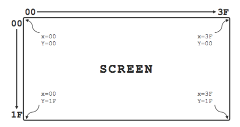

**Note: This document is licensed under [Creative Commons Attribution Share Alike 4.0](http://creativecommons.org/licenses/by-sa/4.0/).**

## Purpose
This document aims to serve as a technical reference for a version of CHIP-8 that remains as closely compatible with Joseph Weisbecker's original implementation on the [COSMAC VIP](https://en.wikipedia.org/wiki/COSMAC_VIP). This document assumes the reader is already familiar with the CHIP-8 programming language.

## Formatting
Within this document, CHIP-8 instructions are formatted as code with no prefix: `1NNN`, `DXYN`, `FX29`.

Constant hexadecimal values are formatted as code and include a 0x- prefix: `0x00`, `0xA7`, `0xFF`.

Constant decimal values are spelled out or written without any prefix: 32, sixteen, 0.

## Instruction set
The [complete CHIP-8 instruction set](./CHIP‐8-Instruction-Set) contains thirty-five instructions.

### Undocumented instructions
Early documentation defines the CHIP-8 instruction set with only thirty-one instructions. [\[2, 4\]](#references) RCA's original COSMAC VIP manual described the `8XY1`, `8XY2`, `8XY4`, and `8XY5` instructions, but `8XY3`, `8XY6`, `8XY7`, and `8XYE` remained undocumented. [\[4\]](#references)

On the COSMAC VIP, the `8XYN` instruction “operates by executing a single byte subroutine formed from the ‘N’ digit,” which accounts for the validity of these latter four instructions. [\[3\]](#references) Because these instructions have been used in many programs compatible with the original CHIP-8 implementation on the COSMAC VIP, this document regards them as part of the original CHIP-8 instruction set.

## Storage in memory
Each CHIP-8 instruction is exactly 2 bytes long. Instructions are stored in memory in a big-endian fashion.

CHIP-8 programs should be loaded into memory starting at address `0x200`. The memory addresses `0x000` to `0x1FF` are reserved for the CHIP-8 interpreter. (Note: A few select hobbyist computers, such as the ETI-660, require that CHIP-8 programs be loaded starting at an address other than `0x200`, but this should not be considered the norm.) [\[1\]](#references)

In addition, the final 352 bytes of memory are reserved for “variables and display refresh,” and should not be used in CHIP-8 programs. On COSMAC VIP systems with 2048 bytes of RAM, this leaves addresses `0x200` to `0x69F` free for use by programs. On VIPs with 4096 bytes of RAM (and modern implementations), this leaves addresses `0x200` to `0xE8F` free. [\[4\]](#references)

## Registers

### Data registers
The CHIP-8 interpreter defines sixteen general purpose data registers, one for each hexadecimal digit: `V0` to `VF`. Each data register is eight bits in length, capable of storing unsigned integer values between `0x00` and `0xFF` inclusive.

The data registers are the primary means of data manipulation provided by the CHIP-8 language. Using various CHIP-8 instructions, registers can be loaded with values, added, subtracted, and more. While any register can be used for data manipulation, it should be noted that the `VF` register is often modified by certain instructions to act as a flag.

### Address register
The 16-bit address register `I` is used with operations related to reading and writing memory. Though it is sixteen bits wide, it can only be loaded with a 12-bit memory address due to the range of memory accessible to CHIP-8 instructions.

## Subroutines
The CHIP-8 interpreter must guarantee sufficient stack space for up to twelve successive subroutine calls. [\[2\]](#references) Modern implementations may wish to allocate enough memory for more than twelve calls.

## Timers
The CHIP-8 interpreter provides two programmable timers, the *delay timer* and the *sound timer*.

Similar to a data register, a timer can be loaded with an unsigned 8-bit value; the instructions `FX15` and `FX18` are used to set the values of the delay timer and sound timer respectively. When a timer is set to a non-zero value, it will count down at a rate of sixty hertz until zero is reached.

The sound timer provides CHIP-8's only facility for sound output. While the sound timer's value is non-zero, a tone will be emitted from the system's speaker. The frequency and waveform of this tone are unspecified. As noted in the COSMAC VIP manual, the minimum value that the timer will respond to is `0x02`. [\[4\]](#references) Thus, setting the timer to a value of `0x01` will have no audible effect.

The delay timer is used by CHIP-8 programs to coordinate events. At any moment in time, the value of the delay timer can be loaded into a data register using the `FX07` instruction.

## Keypad input
The CHIP-8 interpreter will accept input from a 16-key keypad, with each key corresponding to a single unique hexadecimal digit. Though vintage systems such as the COSMAC VIP actually provided the user with a hex keypad for input, modern interpreter implementations may simulate a hexadecimal keypad by mapping the key presses of a standard keyboard accordingly.

The layout of the 16-key keypad is as follows:

    ╔═══╦═══╦═══╦═══╗
    ║ 1 ║ 2 ║ 3 ║ C ║
    ╠═══╬═══╬═══╬═══╣
    ║ 4 ║ 5 ║ 6 ║ D ║
    ╠═══╬═══╬═══╬═══╣
    ║ 7 ║ 8 ║ 9 ║ E ║
    ╠═══╬═══╬═══╬═══╣
    ║ A ║ 0 ║ B ║ F ║
    ╚═══╩═══╩═══╩═══╝

## Graphics
The CHIP-8 interpreter allows for graphics output onto a monochrome screen of 64 × 32 pixels. The top-left corner of the screen is assigned `(x,y)` coordinates of `(0x00, 0x00)`, and the bottom-right is assigned `(0x3F, 0x1F)`.

A pixel can either be set to `0x0` or `0x1`. All pixels on the screen are set to `0x0` by default. (The `00E0` instruction will clear the screen and return all pixels to `0x0`.) On the COSMAC VIP, an "on" pixel with a value of `0x1` is rendered as white, and an "off" pixel with a value of `0x0` is rendered as black. The colors used by a CHIP-8 emulator to render on and off pixels are implementation-dependent.

Sprites are drawn to the screen using the `DXYN` instruction. All sprites are rendered using an exclusive-or (XOR) mode; when a request to draw a sprite is processed, the given sprite's data is XOR'd with the current graphics data of the screen.

If the program attempts to draw a sprite at an x coordinate greater than `0x3F`, the x value will be reduced modulo 64. Similarly, if the program attempts to draw at a y coordinate greater than `0x1F`, the y value will be reduced modulo 32. Sprites that are drawn partially off-screen will be clipped.

Sprites are always eight pixels wide, with a height ranging from one to fifteen pixels.

## Fonts
The memory of the CHIP-8 interpreter will be preloaded with sprite data representing a font of sixteen hexadecimal digits. The memory addresses at which this data resides are unspecified, but it must be stored within memory reserved for the interpreter, usually at addresses lower than `0x200`. Each sprite is four pixels wide by five pixels tall.

The `FX29` instruction can be used to set the `I` register to the address of the sprite data corresponding to a hexadecimal digit stored in a data register `VX`. The `DXYN` instruction can then be used to output a font character to the screen.

The font's sprite data is as follows:

|            Graphic             |           Data           |
|:------------------------------:|:------------------------:|
|  | `F0` `90` `90` `90` `F0` |
|  | `20` `60` `20` `20` `70` |
|  | `F0` `10` `F0` `80` `F0` |
|  | `F0` `10` `F0` `10` `F0` |
|  | `90` `90` `F0` `10` `10` |
|  | `F0` `80` `F0` `10` `F0` |
|  | `F0` `80` `F0` `90` `F0` |
|  | `F0` `10` `20` `40` `40` |
|  | `F0` `90` `F0` `90` `F0` |
|  | `F0` `90` `F0` `10` `F0` |
|  | `F0` `90` `F0` `90` `90` |
|  | `E0` `90` `E0` `90` `E0` |
|  | `F0` `80` `80` `80` `F0` |
|  | `E0` `90` `90` `90` `E0` |
|  | `F0` `80` `F0` `80` `F0` |
|  | `F0` `80` `F0` `80` `80` |

# References
[1]: Phil Cohen. “Programming in CHIP-8 — a crash course”. In: *Electronics Today International* (Nov. 1981), pp. 115–121.

[2]: Harry Kleinberg. *Programming in CHIP-8*. RCA Corporation, 1978.

[3]: Peter K. Morrison. *Untitled*. In: *VIPER* 1.2 (Aug. 1978), pp. 2–6.

[4]: *RCA COSMAC VIP CDP18S711 Instruction Manual*. RCA Corporation, 1978.
